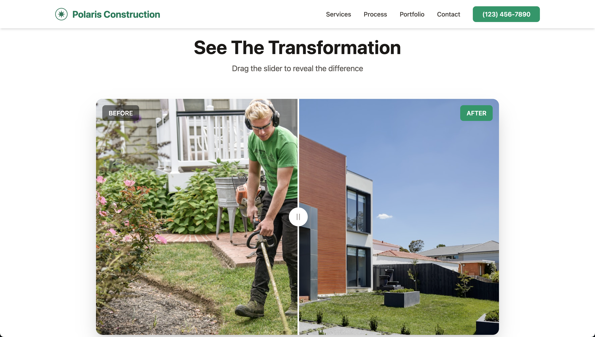
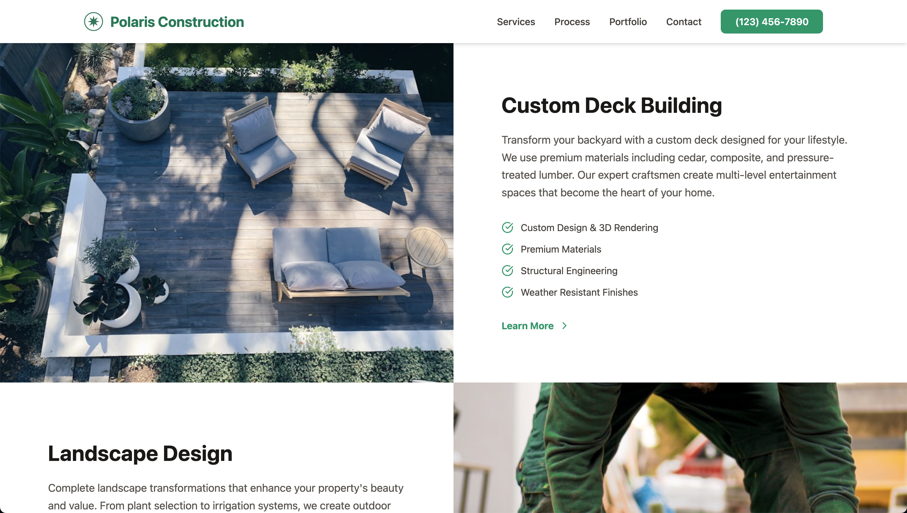

# Polaris Construction Website
*A modern construction company website built with React and Tailwind CSS*

## Built With

## Table of Contents
- [Description](#description)
  - [Deployed Site](#deployed-site)
- [Features](#features)
- [Screenshots](#screenshots)
- [Technical Details](#technical-details)
- [Roadmap](#roadmap)
- [Acknowledgments](#acknowledgments)
- [License](#license)
- [Questions](#questions)

## Description
A professional construction company website designed to showcase projects, demonstrate expertise, and generate leads. Built with React and Tailwind CSS, the site demonstrates how modern web development can help construction businesses establish credibility with interactive before/after comparisons, detailed process timelines, portfolio galleries, and streamlined contact forms.

**Note**: This is a demonstration project showcasing modern web development for construction and contracting businesses. All business details, contact information, project images, and client testimonials are placeholder content.

### Deployed Site
Visit the live website at: 

## Features
- **Interactive Before/After Slider**: Draggable comparison slider showing project transformations
- **Company Stats Bar**: Key metrics displaying experience and credibility
- **Responsive Design**: Mobile-first approach with adaptive layouts and hamburger menu
- **Split-Layout Services**: Alternating image and text sections with feature highlights
- **Interactive Process Timeline**: Five-step workflow with hover states and progress indicator
- **Masonry Portfolio Grid**: Dynamic grid layout with variable-sized project cards and hover details
- **Contact Form**: Request estimate form with business information cards
- **Smooth Scrolling Navigation**: Fixed header with click-to-scroll functionality
- **Modern UI**: Stone/emerald color scheme, Lucide React icons, and professional animations

## Screenshots

## Technical Details
This website implements modern web development practices:

- **Frontend Architecture**: React functional components with hooks (useState, useEffect, useRef), single-file structure appropriate for landing page scope
- **Interactive Features**: Custom drag-to-compare slider using refs and mouse events, hover-activated timeline states, click-outside menu detection
- **State Management**: React hooks for menu state, slider position, active timeline step, and form handling
- **Styling**: Tailwind CSS utility classes with consistent design system, responsive breakpoints (sm, md, lg), and custom animations
- **Performance**: Vite for fast builds and HMR, optimized CDN images, minimal bundle size
- **User Experience**: Smooth scroll behavior, interactive hover states, mobile-optimized touch targets, intuitive drag interactions
- **Code Quality**: Clean component structure, semantic HTML, conventional commits workflow
- **Development**: Incremental feature development with structured git history

## Roadmap
- [x] Add screenshot images to README
- [x] Deploy to production
- [ ] Implement backend integration for contact form
- [ ] Add project detail modal/page
- [ ] Integrate Google Maps for service area visualization
- [ ] Add client testimonials carousel
- [ ] Implement project filtering by category
- [ ] Add cost calculator tool
- [ ] Create blog section for home improvement tips
- [ ] Integrate with project management system

## Acknowledgments
- Images sourced from [Unsplash](https://unsplash.com/)

## License

This project is licensed under the [MIT](https://opensource.org/licenses/MIT) license - see the LICENSE file for details.

## Questions
For any questions, feel free to email me at hello@austingraham.ca.